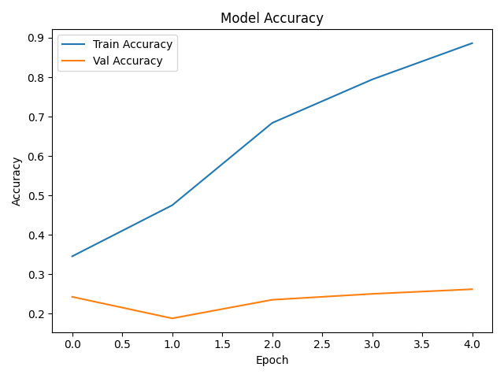
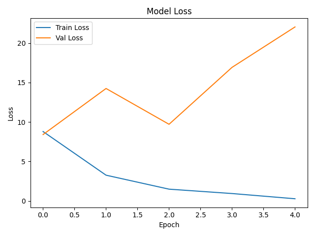
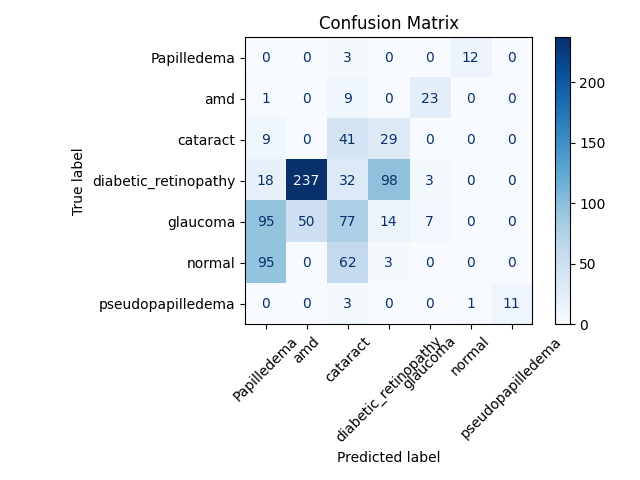

# 👁️ Eye Disease Detector  

  
  
  
  
  

An AI-powered web application that detects **eye diseases** from retinal images using **Deep Learning**.  
Built with **Streamlit**, **TensorFlow/Keras**, and **Computer Vision**, this app aims to assist in early detection of eye disorders.  

🔗 **Live Demo**: [Eye Disease Detector](https://eye-disease-detector1-369.streamlit.app/)  

---

## ✨ Features  

- 🔮 **AI Prediction** – Upload retina image → get disease + confidence
- 🔥 **Explainability** – Grad-CAM heatmap shows where the model looked
- 🗂 **Patient Records** – Auto-saves to `patient_records.csv`
- 📄 **PDF Reports** – One-click report (image, prediction, heatmap, QR)
- 🌍 **Nearby Hospitals** – IP-based locator (embed Google Maps)
- 🗣 **Voice Q&A** – Whisper + TTS for basic disease questions
- 🌐 **English/Hindi** toggle
- 📸 **Webcam** & **Batch mode** support

---

## 🧠 Supported Classes (7)
| ID | Class                | Notes                                          |
|----|----------------------|------------------------------------------------|
| 0  | **Normal**           | Healthy retina                                 |
| 1  | **Glaucoma**         | Optic nerve damage / high IOP                  |
| 2  | **Diabetic Retinopathy** | Retinal micro-vascular damage            |
| 3  | **Cataract**         | Clouding of natural lens                       |
| 4  | **AMD**              | Age-related macular degeneration               |
| 5  | **Papilledema**      | Optic disc swelling due to raised ICP          |
| 6  | **Pseudopapilledema**| Disc elevation mimicking papilledema (benign) |

> 📝 These map to the entries in `labels.txt`. Softmax head outputs 7 probabilities.

---

## 🏗️ Model Architecture (summary)
- **Backbone:** MobileNetV2 (ImageNet weights) – loaded from `keras_model.h5`
- **Head:** Global Average Pooling → Dense → **Softmax (7 classes)**
- **Last Conv Layer (for Grad-CAM):** `Conv_1`
- **Input:** 224×224 RGB, normalized to `[0,1]`
- **Loss:** Categorical Cross-Entropy  
- **Optimizer:** Adam  
- **Explainability:** Grad-CAM generated from last conv layer and blended on input
- **Serving:** Streamlit UI (`app.py`)

---

## 📊 Training/Inference Metrics

---

## 🗂 Project Structure
📁 eye-disease-detector
│── app.py
│── keras_model.h5
│── labels.txt
│── generate_metrices.py
│── check_model.py
│── accuracy_curve.png
│── loss_curve.png
│── confusion_matrix.png
│── patient_records.csv
│── requirements.txt
│── runtime.txt
│── README.md

---

## 🔭 Future Scope

With more computing resources and real-world deployment, we plan to:

- 📈 **Advanced Architectures** – Upgrade to EfficientNet / ResNet-50 for higher accuracy  
- 🩺 **Bigger Datasets** – Train on large-scale retina datasets like **EyePACS** for robustness  
- 📷 **Real-time Scanning** – Enable webcam/mobile-based retina scans  
- 🎥 **Video Diagnostics** – Support continuous video-based analysis from fundus cameras  
- 🗣️ **Accessibility First** – Voice-enabled results for visually impaired users  
- 🌍 **Multilingual Expansion** – Add regional language support for wider adoption  
- 📊 **Smart Dashboard** – Interactive dashboard for doctors/patients with prediction trends

---

## 🛠️ Tech Stack  

- 🐍 **Python 3.11** – Core programming language  
- 🎨 **Streamlit** – Simple & interactive web UI  
- 🤖 **TensorFlow / Keras** – Deep Learning model training & inference  
- 📊 **Matplotlib / Seaborn** – Accuracy, Loss & Confusion Matrix visualizations  
- 📝 **Pandas** – Patient record management (CSV handling)  
- 🔊 **Pyttsx3** – Voice feedback integration  
- 🌐 **Deep-Translator API** – Multi-language support  
- 🗺️ **Geopy / IPinfo** – Nearby hospital locator

--- 

## 🤝 Contribution  

Pull requests are welcome!  
For major changes, please open an issue first to discuss what you would like to change.

--- 

## 🙏 Acknowledgements  

We would like to thank:  
- **Abhijith Sir** – for guiding us throughout the project.  
- **Public Datasets** – EyePACS & Kaggle Retina datasets that enabled us to train our model.  
- **Open Source Community** – TensorFlow, Streamlit, Deep Translator, and other amazing tools.  
- **Healthcare Inspiration** – This project is dedicated to making early eye & brain disease detection more accessible, especially for rural and underserved communities.
